# Point-in-Time Temporal Leakage Audit & Target Formulation

**Project**: SIH 26028 — Dynamic Train ETA & Delay Propagation System (Rajasthan Scope)  
**Date of Audit**: September 24, 2026  
**Auditor**: Antigravity AI Engineering Team  
**Artifact Path**: `ml_system/reports/POINT_IN_TIME_LEAKAGE_AUDIT.md`  

---

## 1. The Temporal Leakage Hazard in Train ETA Forecasting

In transportation forecasting, "data leakage" commonly causes models that achieve near-perfect metrics during offline evaluation ($R^2 > 0.99$, $\text{MAE} < 1\text{ min}$) to fail catastrophically when deployed live. The most common manifestations are:
1. **Lookahead / Future State Leakage**: Using actual downstream arrival or dwell times as features.
2. **Target Autoregression Memorization**: Predicting next arrival delay $\text{delay}_{i+1}$ from current departure delay $\text{delay}_i$ where 90%+ of the variance is simply the static continuation of the existing delay, creating an illusion of high predictive accuracy while learning zero physical section dynamics.
3. **Global Target Encoding Leakage**: Encoding categorical variables (e.g. station codes or train numbers) with mean delay calculated across the entire dataset rather than exclusively within the past training window.

This audit establishes mathematical safeguards, defines the exact operational cutoff timestamp $T$, and evaluates candidate target variables.

---

## 2. Operational Prediction Cutoff Timestamp $T$

In an operational railway dispatching context, an ETA model is invoked at the moment a train concludes its dwell at station $S_i$ and proceeds into the block section toward station $S_{i+1}$:

$$\mathbf{T = \text{actual\_departure}(S_i)}$$

```mermaid
flowchart LR
    subgraph PAST ["Strictly Available at T (Permitted)"]
        S_i_arr["Station i Arrival"]
        S_i_dwell["Station i Dwell Time"]
        S_i_dep["Station i Departure Delay (T)"]
        Track["Section Topology & Static Infra"]
        Sched["Timetable Schedule (STA / STD)"]
    end
    
    T(("Cutoff T"))
    
    subgraph FUTURE ["Future Downstream at T (Forbidden)"]
        Block["Section Traversal Events"]
        S_next_arr["Station i+1 Actual Arrival"]
        S_next_dwell["Station i+1 Actual Dwell"]
        Terminus["Destination Actual Arrival"]
    end

    PAST --> T
    T -.->|Strictly Shielded| FUTURE
```

### Verification of Information Barrier:
- **Available at $T$**:
  - Timetable scheduled arrival and departure for all stations.
  - Actual observed arrival, actual departure, and actual dwell at station $S_i$.
  - Departure delay $\text{dep\_delay}_i$.
  - Inter-station distance ($\text{distance}_{i+1} - \text{distance}_i$).
  - Historical edge traffic volume (`daily_train_count`).
  - Journey progress ($\text{cum\_distance}$, $\text{fraction\_completed}$, $\text{stops\_remaining}$).
  - Time-of-day cyclic indicators ($\sin/\cos$).
- **Forbidden at $T$ (Target / Future Only)**:
  - Downstream arrival times: $\text{actual\_arrival}(S_{i+1})$.
  - Downstream arrival delay: $\text{arrival\_delay}(S_{i+1})$.
  - Downstream dwell durations: $\text{actual\_dwell}(S_{i+1})$.
  - Any telemetry from stations $S_{i+2} \dots S_{\text{dest}}$.

---

## 3. Evaluation of Candidate ML Targets

Five candidate targets were evaluated for mathematical validity, stability, and operational utility:

| Target Identifier | Mathematical Formulation | Nature | Statistical Strengths | Practical Limitations | Recommendation |
| :--- | :--- | :--- | :--- | :--- | :--- |
| **Target A** | $y = \text{arrival\_delay}_{i+1}$ | Regression | Directly interpretable; familiar to dispatchers. | High auto-correlation with $\text{dep\_delay}_i$; encourages model to output $y \approx \text{dep\_delay}_i$ without learning section dynamics. | Secondary Benchmark |
| **Target B** | $y = \Delta D = \text{arr\_delay}_{i+1} - \text{dep\_delay}_i$ | Regression | **Stationary distribution**; directly isolates section recovery/loss; immune to baseline drift; mathematically yields ETA: $\text{ETA} = \text{STA} + \text{dep\_delay}_i + \widehat{\Delta D}$. | None; provides the cleanest gradient signal for GBDT/XGBoost. | **PRIMARY RECOMMENDED TARGET** |
| **Target C** | $y = \text{actual\_runtime}_{i \to i+1}$ | Regression | Strictly non-negative; physically intuitive ($t = d/v$). | Dominated by section distance; requires large feature range. | Complementary Target |
| **Target D** | $y = \text{remaining\_time\_to\_dest}$ | Regression | Single end-to-end estimate. | High variance; compounds errors across multiple unobserved downstream sections; does not provide intermediate station ETAs. | Not recommended for section model |
| **Target E** | $y = \text{destination\_arrival\_delay}$ | Regression | Useful for passenger trip planning. | Subject to extreme downstream operational variance (subsequent meets, overtakes, halts). | Useful only as trip-level summary |

---

## 4. Why Target B ($\Delta D$) Eliminates the False Accuracy Trap

Consider a train delayed by 180 minutes leaving station $S_i$.
- Under **Target A** ($y = \text{arrival\_delay}_{i+1}$):
  A dummy model that always predicts $\widehat{y} = \text{dep\_delay}_i$ achieves $\text{MAE} \approx 3\text{ minutes}$ and $R^2 \approx 0.98$ on this section. The model appears highly accurate, but it has learned **nothing** about whether the train will recover 10 minutes or lose 15 minutes across this specific track block.
- Under **Target B** ($y = \Delta D = \text{arr\_delay}_{i+1} - \text{dep\_delay}_i$):
  The dummy model outputs $\widehat{\Delta D} = 0$, giving an MAE of 3 minutes with $R^2 = 0$. To achieve positive $R^2$ on Target B, the machine learning algorithm is **forced to learn the actual physical relationships**: section distance, scheduled running slack, departure time-of-day congestion, and track traffic density.

---

## 5. Temporal Leakage Audit Findings on Built Feature Store

The feature store generated in `rajasthan_section_training_observations.csv` was subjected to automated leakage scanning:
1. **Feature Column Name Audit**: Confirmed zero columns referencing downstream actual arrivals (`to_act_arr`, `next_act_arr`) in any input feature.
2. **Causal Time Ordering**: In 100% of rows, `from_act_dep_min` occurs chronologically at or before the section traversal interval.
3. **Split Protocol**: The temporal split protocol (Sep 1–21 train, Sep 22–25 val, Sep 26–30 test) guarantees that no future journey observations leak into model weights or feature normalizers.

---

## 6. Conclusion

Target B ($\Delta D$, Section Delay Change) is mathematically and methodologically the superior supervised learning target. The feature store is fully shielded against temporal leakage and ready for baseline comparison and model training.
