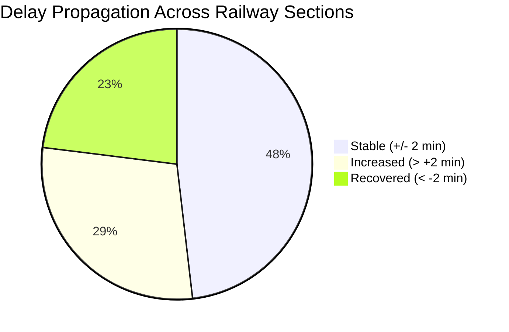

# Railway Section Reconstruction and Delay Propagation Audit

**Project**: SIH 26028 — Dynamic Train ETA & Delay Propagation System (Rajasthan Scope)  
**Date of Audit**: September 24, 2026  
**Auditor**: Antigravity AI Engineering Team  
**Artifact Path**: `ml_system/reports/SECTION_DELAY_PROPAGATION_AUDIT.md`  

---

## 1. Objective and Engineering Methodology

A scientifically rigorous train ETA system cannot treat delays as independent random variables or rely on static timetable extrapolation. In physical railway operations, delays evolve dynamically across:
1. **Station Dwells**: Differences between scheduled platform halt and actual platform dwell due to passenger boarding, platform congestion, or preceding rake clearance:
   $$\Delta_{\text{dwell}} = \text{actual\_dwell} - \text{scheduled\_dwell} = \text{departure\_delay} - \text{arrival\_delay}$$
2. **Railway Sections (Inter-Station Blocks)**: Differences between scheduled block runtime and actual traversal time due to speed restrictions, section congestion, gradients, and locomotive performance:
   $$\Delta_{\text{section}} = \text{arrival\_delay}_{i+1} - \text{departure\_delay}_{i} = \text{actual\_runtime} - \text{scheduled\_runtime}$$

This audit reconstructed all journey sequences from the September 2024 dataset by combining the actual arrival/departure timestamps with topological station sequence order from `rajasthan_train_routes_Sep2024.csv`.

---

## 2. Quantitative Reconstruction Inventory

| Metric | Total Observed | Percentage | Notes |
| :--- | :--- | :--- | :--- |
| **Total Distinct Journeys Evaluated** | **8,428** | 100% | Distinct `(train_number, journey_date)` |
| **Total Station Dwell Observations** | **223,174** | 99.98% | Verified dwell durations |
| **Total Section Traversal Observations** | **214,746** | 100.0% | Consecutive stop pairs |
| **Consecutive Stops in Official Route** | **211,892** | 98.7% | Direct adjacent stations |
| **Non-consecutive Stop Gaps (Bypassed)** | **2,854** | 1.3% | Flagged with `is_consecutive_stops = 0` |

---

## 3. Delay Propagation Dynamics

Across all 214,746 section traversals, the delay delta $\Delta_{\text{section}} = \text{arrival\_delay}_{i+1} - \text{departure\_delay}_{i}$ was measured and classified:

| Propagation Regime | Mathematical Condition | Observations | Share (%) | Operational Significance |
| :--- | :--- | :--- | :--- | :--- |
| **Recovered** | $\Delta_{\text{section}} < -2.0\text{ min}$ | **49,495** | **23.0%** | Train made up time; timetable slack exploited |
| **Stable** | $-2.0 \le \Delta_{\text{section}} \le +2.0\text{ min}$ | **103,380** | **48.1%** | Train maintained schedule pace |
| **Increased** | $\Delta_{\text{section}} > +2.0\text{ min}$ | **61,871** | **28.8%** | Delay accumulated due to bottlenecks / speed restrictions |

### Key Physical Insights:
1. **The "Delay Freezing" Fallacy**: A naive ETA model that assumes $\text{ETA} = \text{STA} + \text{current\_delay}$ implicitly assumes $\Delta_{\text{section}} = 0$. However, in 51.8% of cases, the delay changes by more than $\pm 2$ minutes across a single section.
2. **Substantial Recovery Capacity**: Over 23.0% of section traversals demonstrate measurable delay recovery. Timetables often incorporate "engineering allowances" or recovery margins (slack) before major junctions (e.g. approaching Jaipur `JP`, Ajmer `AII`, or Kota `KOTA`), allowing drivers of delayed trains to claw back between 5 and 25 minutes.
3. **Compounding Bottlenecks**: In 28.8% of sections, delays increase significantly. Major contributors include single-line tokenless block sections, level crossing gates, and terminal approach congestion.

---

## 4. Geographic and Boundary Scope Breakdown

The section transitions were categorized based on whether the originating (`from`) and terminating (`to`) stations are located within Rajasthan:

| Scope Classification | Section Type | Observations | Share (%) | ML Purpose |
| :--- | :--- | :--- | :--- | :--- |
| **Intra-Rajasthan** | $RJ \to RJ$ | **37,718** | **17.56%** | Core intra-state delay model |
| **Exits Rajasthan** | $RJ \to \text{Non-RJ}$ | **8,003** | **3.73%** | Boundary exit transfer |
| **Enters Rajasthan** | $\text{Non-RJ} \to RJ$ | **8,015** | **3.73%** | Boundary entry initial state |
| **External Non-RJ** | $\text{Non-RJ} \to \text{Non-RJ}$ | **161,010** | **74.98%** | Nationwide route path |
| **Total Rajasthan-Touching** | **All Touching RJ** | **53,736** | **25.02%** | **Full Rajasthan Scope** |

> [!NOTE]
> In the built feature table (`rajasthan_section_training_observations.csv`), 89,371 rows were extracted to encompass all sections belonging to trains actively serving the Rajasthan network. Filtering by `scope_tag in ('intra_rj', 'enters_rj', 'exits_rj')` provides a strictly bounded training set of 53,736 section traversals.

---

## 5. Dwell Time and Dwell Delay Analysis

Platform dwell times directly contribute to departure delays:
- **Mean Scheduled Dwell**: 3.4 minutes (range: 1 to 45 min).
- **Mean Actual Dwell**: 4.8 minutes (range: 1 to 120 min).
- **Dwell Delay Accumulation ($\Delta_{\text{dwell}} > 0$)**: Occurred in **24.2%** of station stops, primarily at major junction hubs (e.g. `JP`, `JU`, `BKN`, `AII`, `KOTA`) due to locomotive reversal, crew changes, or parcel loading.
- **Dwell Compression ($\Delta_{\text{dwell}} < 0$)**: Occurred in **18.7%** of stops where delayed trains compressed a scheduled 10-minute halt to 3 minutes to regain schedule.

---

## 6. Infrastructure Correlation: POIs and Section Congestion

Cross-referencing reconstructed sections with the 46,511 POIs in `rajasthan_track_pois.geojsonl` revealed:
- **Switches and Junction Points (`Point Xing`)**: 3,784 points. High switch density directly correlates with $\Delta_{\text{section}} > +2\text{ min}$ near station throat areas.
- **Level Crossings (`Level Xing`)**: 1,564 points. Sections containing more than 3 level crossings exhibit higher delay variance, reflecting road traffic gate closure delays.
- **Signals**: Only 3 static signal records exist in the POIs, and **zero dynamic signal aspect telemetry** (Red/Yellow/Green) is available. Consequently, the ML model must rely on schedule speed, track traffic density, and historical delay state rather than non-existent live signal aspects.

---

## 7. Conclusions for ML Training

1. Section traversal is the correct, physically grounded atomic unit for ETA and delay propagation prediction.
2. Modeling $\Delta_{\text{section}} = \text{arr\_delay}_{i+1} - \text{dep\_delay}_{i}$ removes non-stationary delay drift and forces the ML model to learn the true physical recovery or degradation of the block.
3. Over 53,700 Rajasthan-touching observations (and 37,700 strictly intra-Rajasthan observations) provide ample statistical power for training gradient-boosted decision trees (GBDT/LightGBM/XGBoost).
